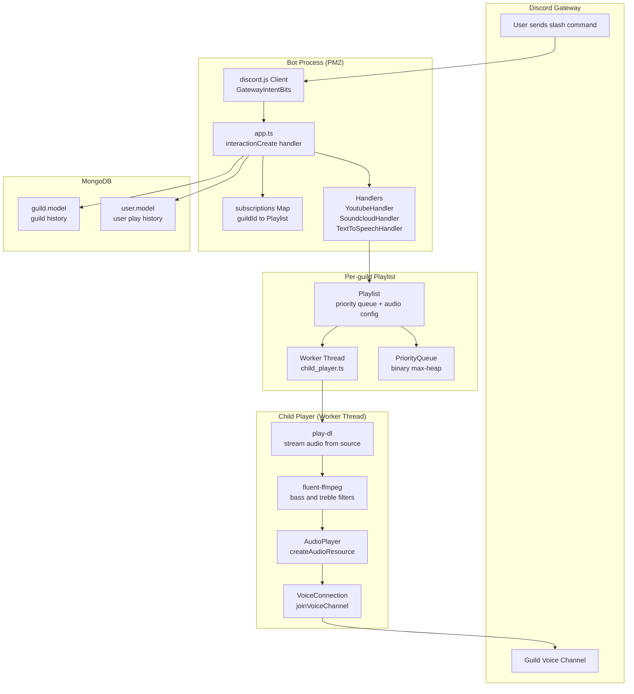
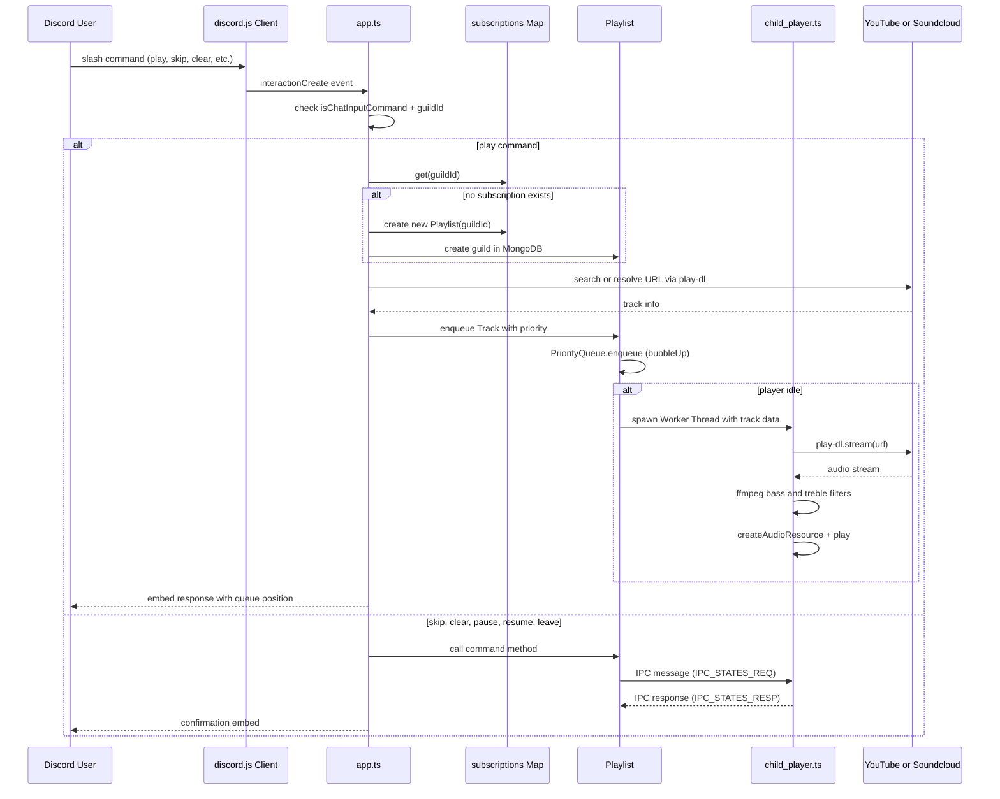
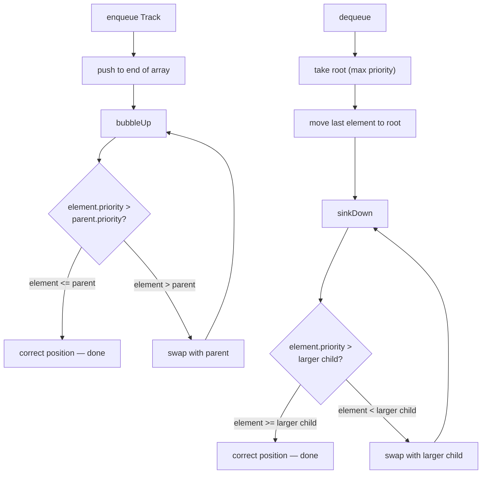
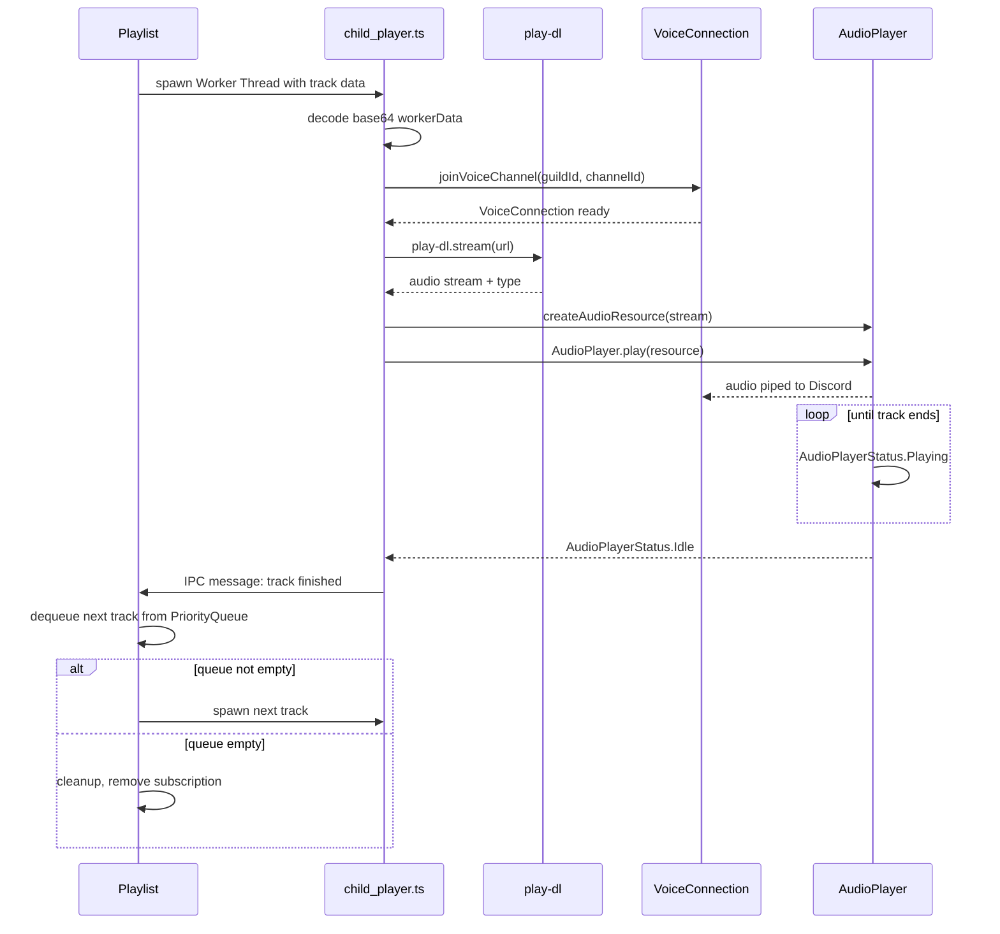
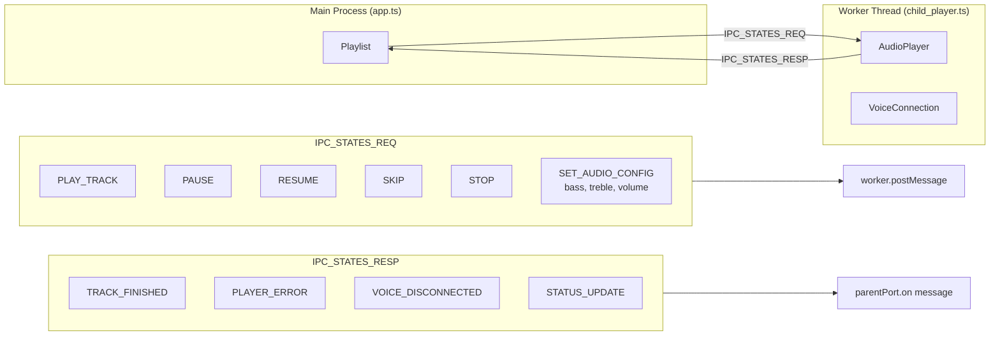
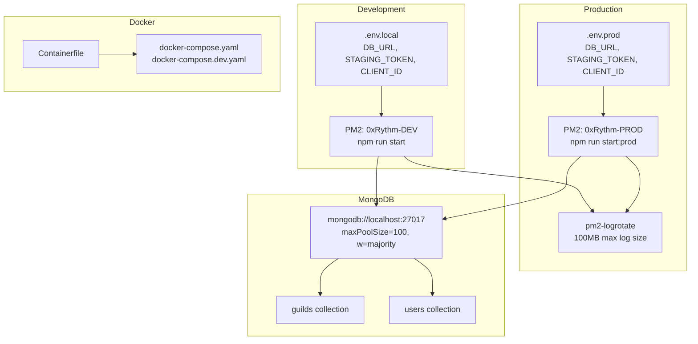

# 0xRhythm-Bot — Architecture

> Node.js Discord audio bot streaming from YouTube and Soundcloud via `play-dl`. Features per-guild priority queue, user/guild play history in MongoDB, and TTS support. Deployed via PM2 with Docker support.

| | |
|---|---|
| **Language** | TypeScript · CommonJS |
| **Runtime** | Node.js 16.17.x |
| **Discord** | discord.js v14 · @discordjs/voice · @discordjs/opus |
| **Audio** | play-dl (YouTube + Soundcloud) · fluent-ffmpeg |
| **Database** | MongoDB via Mongoose |
| **Process** | PM2 (dev + prod) · Docker (Containerfile + docker-compose) |
| **TTS** | node-gtts |

---

## High-Level Architecture

---

## Slash Command Flow

---

## Priority Queue — Binary Max-Heap

Tracks are ordered by `TrackPriority` (0=LOW, 1, 2 — higher overrides queue position). Ties are broken by `creationDate` (newer first). The max element is guaranteed at the root.

---

## Track Playback Lifecycle

---

## IPC Between Main and Worker Thread

The main process (`app.ts`) and the child player (`child_player.ts`) communicate via Node.js `worker_threads` IPC messages, defined in `constants/ipcStates.ts`.

---

## Deployment Topology

